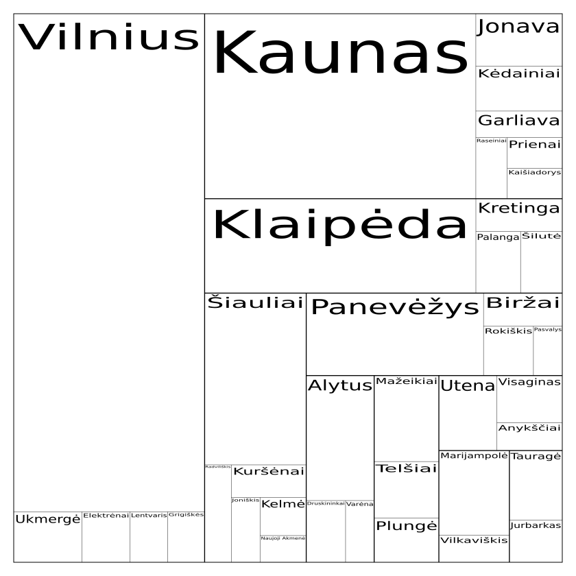

# `treemap-svg` :: a CLI tool for drawing treemap diagrams

## Generic information on building from source with Cargo

The following commands are supposed to be executed in Linux shell in the repository's root.

Building and running on other systems (Windows, OSX, BSD) may differ.

### [Install Rust](https://www.rust-lang.org/tools/install)

### Building

```bash
cargo build
```

### Running

You can run either through Cargo:

`cargo run -- -i <input_yaml> -o <output_svg>`

... or run directly as an executable:

`target/debug/treemap-svg -i <input_yaml> -o <output_svg>`

### Installing

`cargo install --path .`

Currently, the program is installed for your user in `~/.cargo/bin`. Verify you have `~/.cargo/bin` included in your `$PATH`:

```bash
$ echo $PATH
/usr/bin:/bin:...
$ # if $PATH does not contain ~/.cargo/bin, then add it likewise:
$ PATH=$PATH:/home/$USER/
$ # Try to launch treemap-svg
$ treemap.svg --version
treemap-svg 0.1.0
$ # if it works, persist $PATH variable:
$ export PATH=$PATH
```


### Uninstalling

`cargo uninstall treemap-svg`

## Example

The following YAML file:

```yaml
# Population of the Top-30 cities in Lithuania
# Grouped by counties (apskritys)
# Source: https://en.wikipedia.org/wiki/List_of_cities_in_Lithuania
Lietuva:
  Vilniaus apskr.:
    Vilnius: 554866
    Ukmergė: 20154
    Elektrėnai: 14197
    Lentvaris: 11105
    Grigiškės: 10867
  Kauno apskr.:
    Kaunas: 292789
    Jonava: 26423
    Kėdainiai: 22677
    Garliava: 13423
    Raseiniai: 11203
    Prienai: 9867
    Kaišiadorys: 9729
  Klaipėdos apskr.:
    Klaipėda: 149431
    Kretinga: 16583
    Palanga: 16038
    Šilutė: 14980
  Šiaulių apskr.:
    Šiauliai: 101854
    Radviliškis: 15161
    Naujoji Akmenė: 7206
    Kuršėnai: 14197
    Joniškis: 10881
    Kelmė: 10302
  Panevėžio apskr.:
    Panevėžys: 85318
    Biržai: 15262
    Rokiškis: 14351
    Pasvalys: 8296
  Alytaus apskr.:
    Alytus: 49551
    Druskininkai: 14172
    Varėna: 10296
  Marijampolės apskr.:
    Marijampolė: 34879
    Vilkaviškis: 11117
  Utenos apskr.:
    Utena: 25397
    Visaginas: 18024
    Anykščiai: 10575
  Telšių apskr.:
    Mažeikiai: 32470
    Telšiai: 21287
    Plungė: 16755
  Tauragės apskr.:
    Tauragė: 21520
    Jurbarkas: 12972
```

... generates such treemap diagram on default:



Note: this is a PNG image representing SVG output.

